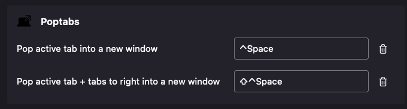
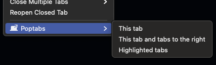

# Poptabs

A tiny Firefox add-on that makes it easy to pop tabs into new windows!

* Configurable Keyboard Shortcuts
* Context menu
* No additional permissions required
* 100% organic, cage-free code
* I made this in like an afternoon lol

## Configurable keyboard shortcuts

Two - count 'em, _two_ big keyboard shortcuts!

* Pop active tab (or all selected tabs) to a new window
* Pop active tab and tabs to the right into a new window

Don't like the keybindings I chose? Hit that [Manage Extension Shortcuts] menu item in the Firefox "Extensions" page!

[Manage Extension Shortcuts]: https://support.mozilla.org/en-US/kb/manage-extension-shortcuts-firefox

## Context menu on tabs

Right-click on a tab and you'll find a **Poptabs** menu, with exciting options like:

* This tab
* This tab and tabs to the right
* Highlighted tabs

Wow! Now you can accomplish the same thing with your mouse! 

 ## WHY?

 I don't need super-fancy tab syncing and grouping and _wizardry_, I just wanted a quick way to move a bunch of newly-opened tabs to their own window. This does the trick and doesn't require extra permissions. GOOD ENOUGH 👍
